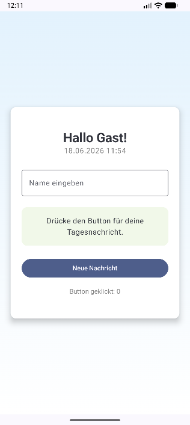

# Mein erstes Android-App-Projekt

Dies ist meine erstes Android-App, erstellt mit Andoid Studio, Kotlin und Jetpack Compose.

## Funktionen

- Begrüßung mit Name
- Anzeige von Datum und Uhrzeit
- Button mit Klickzähler

## Screenshot

## Technologien

- Kotlin
- Jetpack Compose
- Android Studio
- Git und GitHub

## Ziel des Projektes

Mit diesem Projekt lerne ich die Grundlagen der Android-Entwicklung und den Umgang mit GitHub
